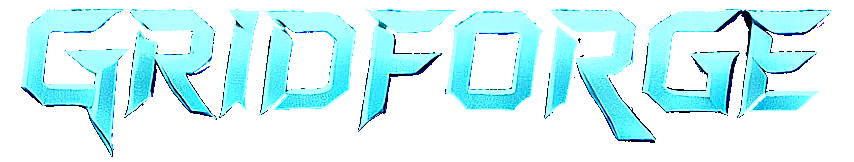

  

    
    
  

---

A game engine created using SDL2 &amp; OpenGL to enhance development of isometric games.

To build the File just run these commands
`cd build`
`cmake -G "MinGW Makefiles" ..`
`cmake --build .`
Then just run the executable file
`learnSDL2.exe`
